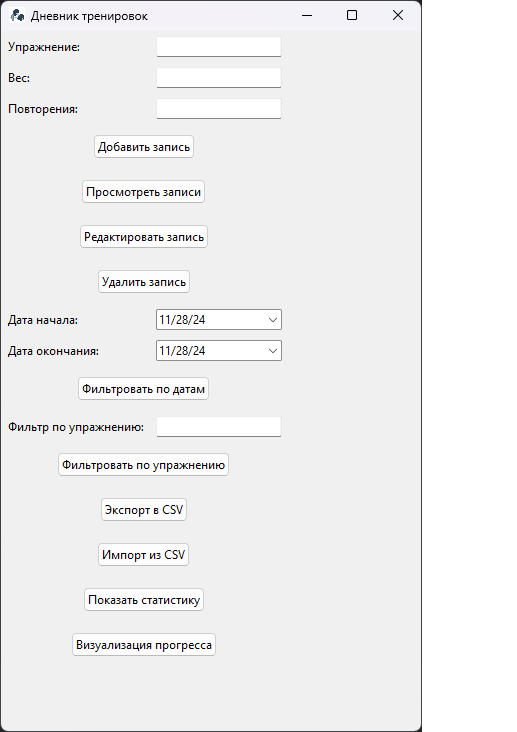
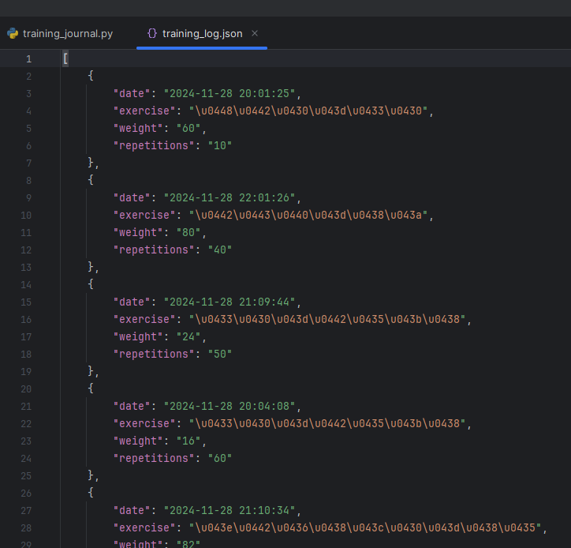
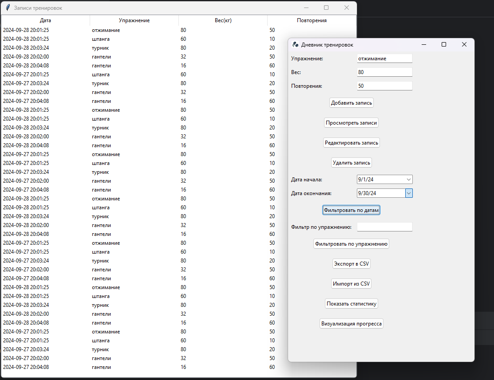
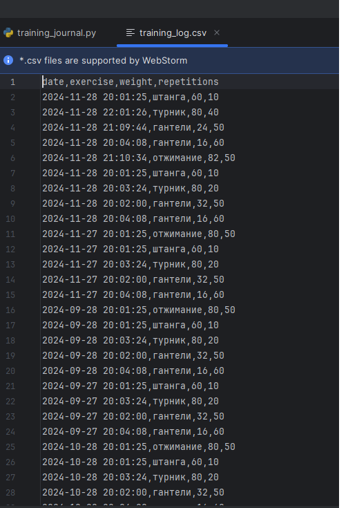
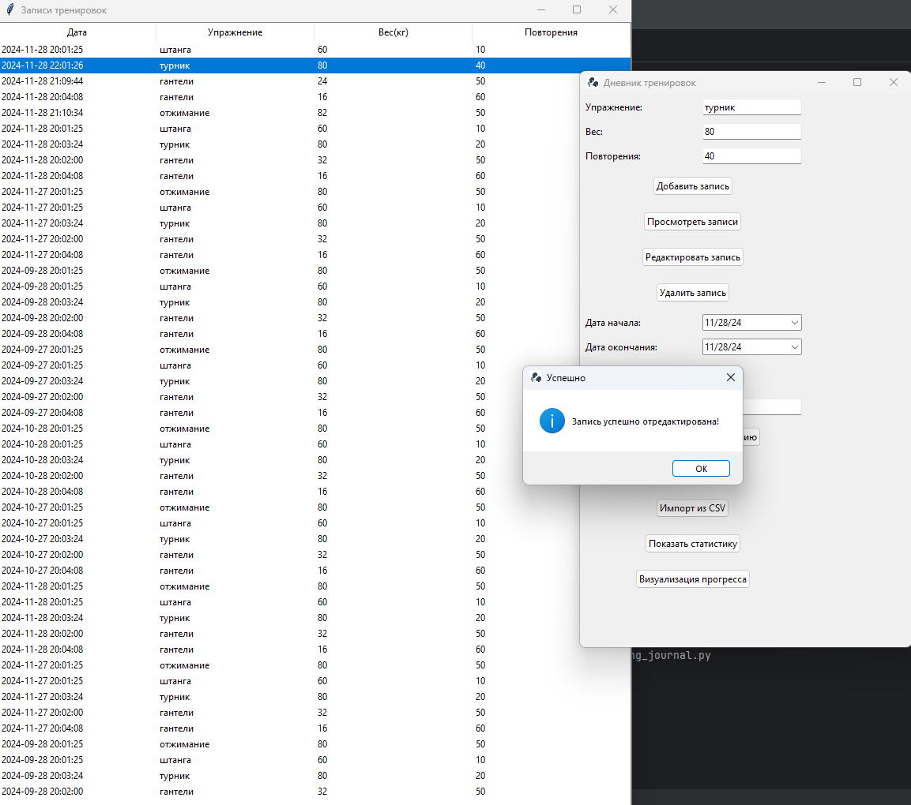
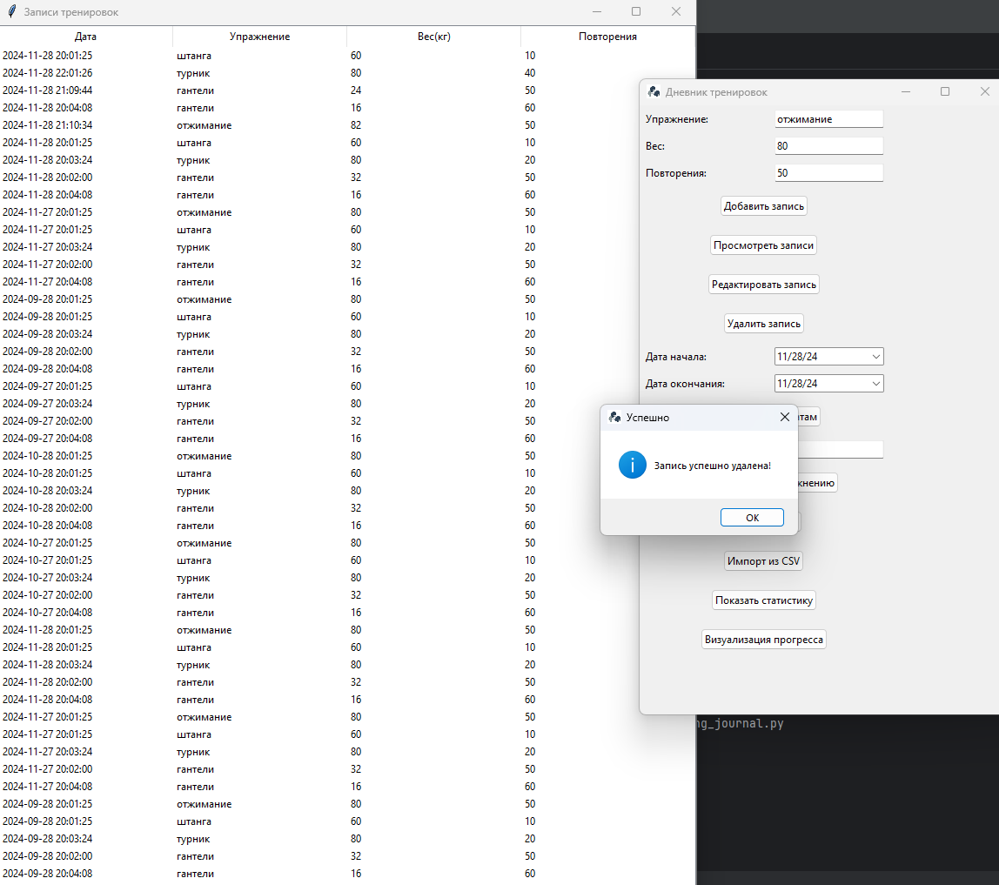
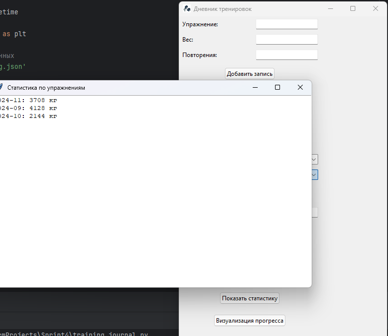
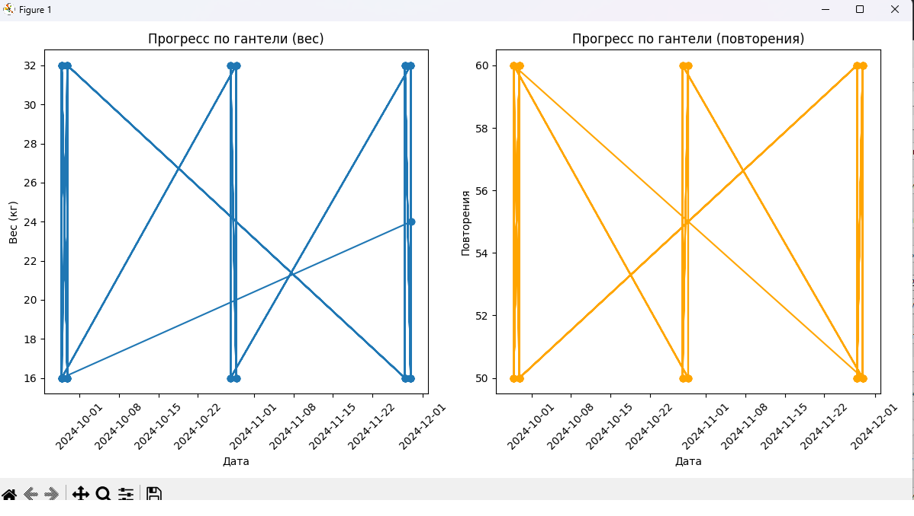

"Журнал тренировок"
Используется tkinter для графического интерфейса.

- Импортируются модули tkinter, ttk из tkinter для работы с графическим интерфейсом пользователя, Toplevel для создания новых окон, 
messagebox для вывода сообщений пользователю, json для работы с данными в формате JSON, datetime для работы с датами и временем.

- Переменная data_file хранит имя файла, в который будут сохраняться данные о тренировках в формате JSON.

Функции загрузки и сохранения данных:

- Функция load_data пытается открыть файл с именем, указанным в переменной data_file, и загрузить из него данные в формате JSON.
Если файл не существует или происходит ошибка при разборе данных, возвращается пустой список.

- Функция save_data принимает данные о тренировках в виде списка словарей и сохраняет их в файл в формате JSON.
Данные форматируются с отступом для лучшей читаемости.

Класс TrainingLogApp:

- Конструктор класса __init__ принимает объект root, который является главным окном приложения, и вызывает метод create_widgets
для создания виджетов интерфейса.

- Метод create_widgets создает виджеты для ввода данных о тренировке (название упражнения, вес, количество повторений), кнопки 
для добавления записи о тренировке и просмотра сохраненных записей.

- Метод add_entry считывает данные из полей ввода, проверяет их наличие, создает словарь с информацией о тренировке, добавляет
его в список с данными и сохраняет изменения в файл. После добавления записи поля ввода очищаются, и пользователю показывается сообщение об успехе.

- Метод view_records загружает сохраненные данные и отображает их в новом окне с помощью виджета Treeview. Для каждой записи создается строка в таблице.

Функция main:

- Создает экземпляр Tk, который является главным окном приложения.

- Создает экземпляр приложения TrainingLogApp, передавая ему главное окно.

- Запускает главный цикл обработки событий Tkinter, чтобы окно приложения отображалось и реагировало на действия пользователя.

Запуск программы:

- Проверяет, что скрипт запущен как основная программа, и в этом случае вызывает функцию main для инициализации и запуска приложения.

Дополнительно реализовано:

1. Фильтрация записей по дате - возможность просматривать записи за определенный период. Функция - filter_by_date

2. Фильтрация записей по упражнению - возможность просматривать записи по конкретному упражнению. Функция - filter_by_exercise

3. Экспорт данных в CSV - функция для экспорта всех записей в CSV файл. Функция - export_to_csv
4. Импорт данных из CSV - функция для импорта записей из CSV файла.  Функция - import_from_csv

5. Редактирование записи - возможность редактировать выбранную запись. Функция - edit_record

6. Удаление записи - возможность удалить выбранную запись. Функция - delete_record

7. Статистика по упражнениям - отображение статистики по выполненным упражнениям (например, суммарный вес за месяц). Функция - show_statistics

8. Визуализация прогресса - графики изменения веса и повторений по упражнениям за определенный период. Функция - visualize_progress
