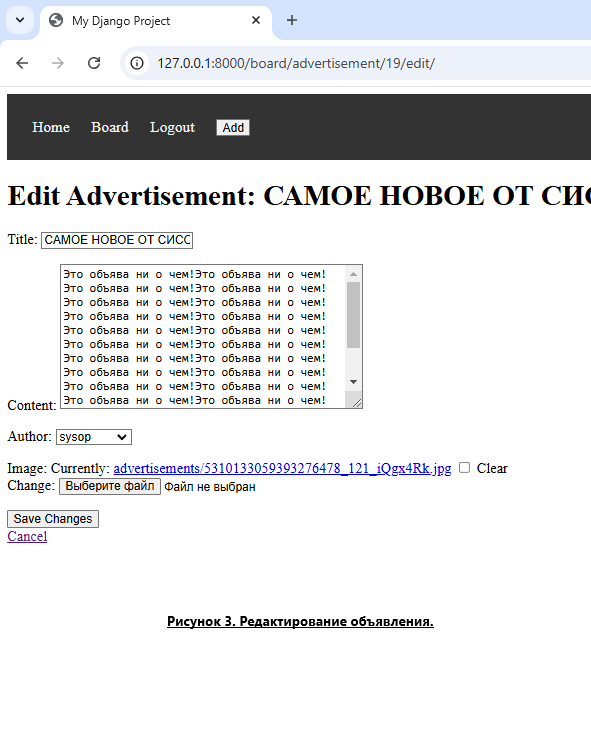
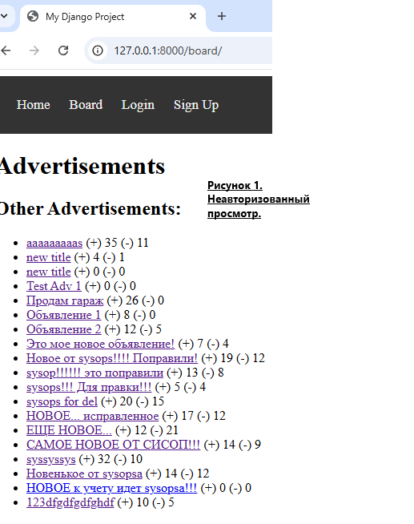
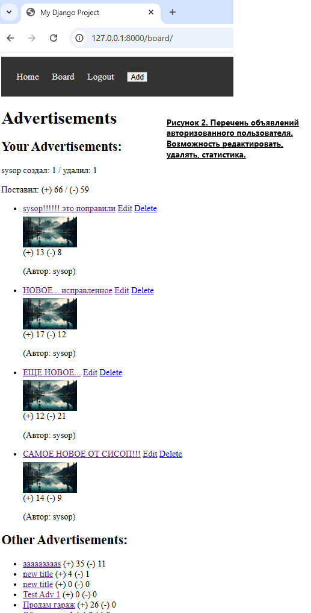
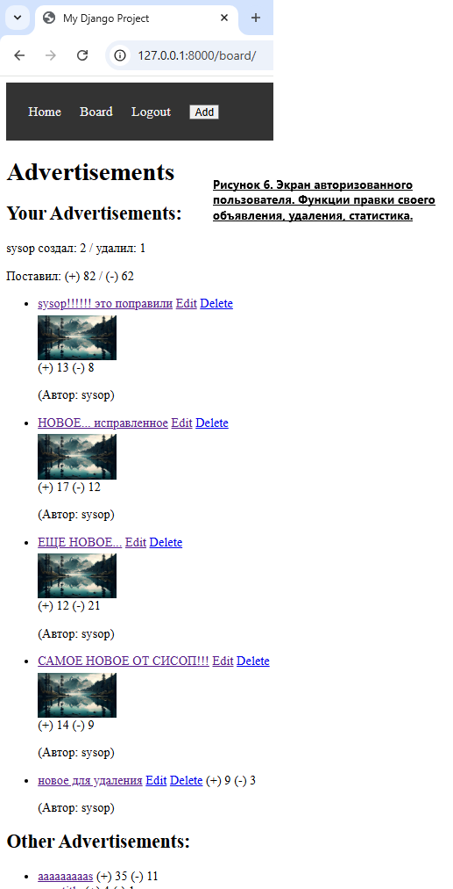
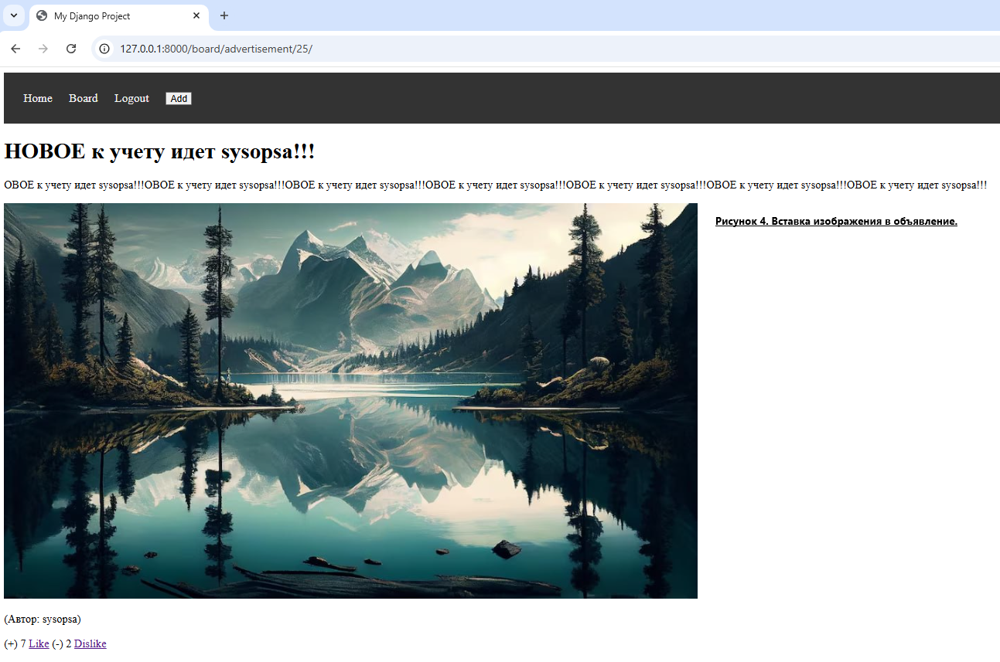
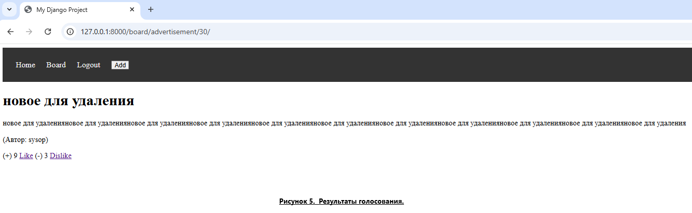
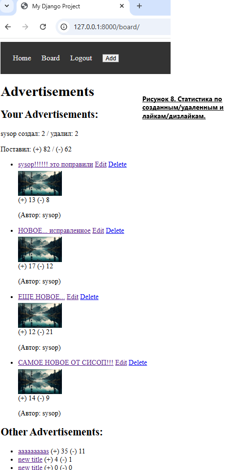
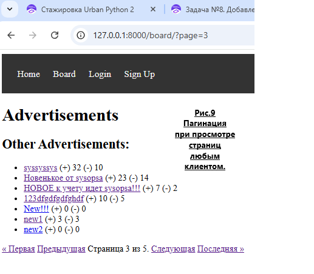
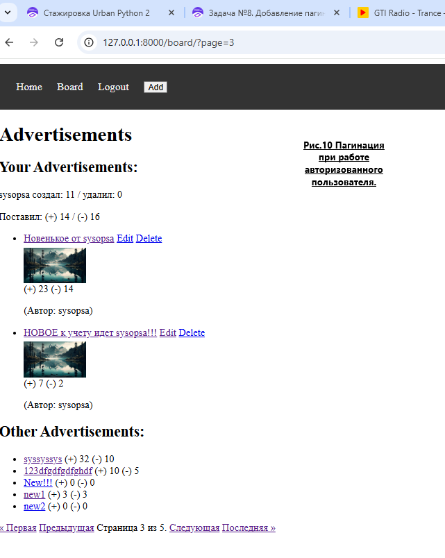

# Сайт объявлений

Это проект на Django, реализующий функционал доски объявлений, позволяющий пользователям добавлять, редактировать, просматривать и удалять объявления.
Также имеется возможность комментирования объявлений.

## Оглавление
- [Функционал](#функционал)
- [Требования](#требования)
- [Установка](#установка)
- [Использование](#использование)
- [Документация](#документация)
- [Лицензия](#лицензия)

## Функционал

- **Регистрация и аутентификация пользователей**:
  - Пользователи могут зарегистрироваться и войти в систему.
  
- **Работа с объявлениями**:
  - Добавление новых объявлений. 
  - Просмотр списка объявлений.
  - Просмотр деталей объявления. 
  - Редактирование своих объявлений.
  - Добавление в объявление изображения. 
  - Удаление своих объявлений.
  - Отображение автора объявления  при просмотре содержимого. 
  - Возможность при просмотре выставлять "Лайк" или "Дизлайк".
  - Сохранение количества созданных объявлений и лайков. 
  - Пагинация.  
	 


## Требования

- Python 3.x
- Django 5.0 или выше
- SQLite (или другая база данных по желанию)

## Установка

1. Клонировать репозиторий:
   ```bash
   git clone https://github.com/yourusername/urban-project.git
   cd urban-project

2. Установить зависимости:

	bash

	pip install -r requirements.txt

3. Настроить базу данных (если используете SQLite, она создастся автоматически):

	bash

	python manage.py migrate

4. Запустить сервер разработки:

	bash

	python manage.py runserver

5. Перейти в браузере по адресу:

        
	http://127.0.0.1:8000

##  Использование

	Регистрация: Переходите по URL /signup/ для создания нового аккаунта.
	Вход в систему: Переходите по URL /accounts/login/.
	Объявления: Перейдите на /board/ для просмотра существующих объявлений. Вы можете добавлять, редактировать и удалять свои объявления, нажав соответствующие кнопки.

